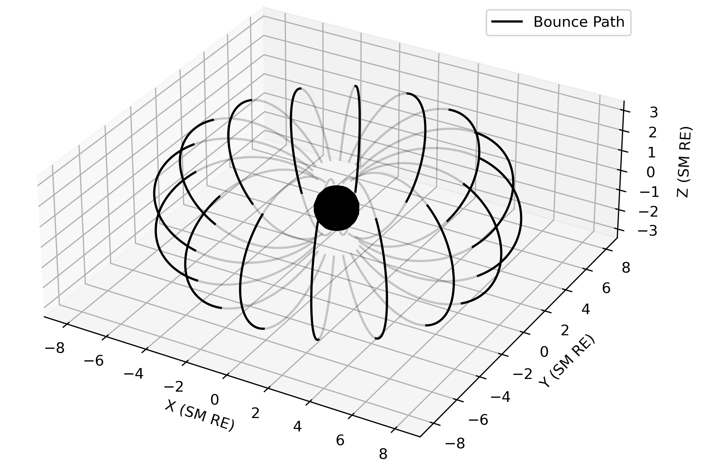

Methodology and References
==========================

This technique is a tool for studying radiation belt physics. It computes adiabatic invariant quantities, known as K and L*. 

.. contents::
   :depth: 2

.. _threecolumn:

What are the Adiabatic Invariants?
----------------------------------
Adiabatic invariants are quantities in classical mechanics that remain constant under slow, reversible changes in a system. They arise in systems where changes occur gradually, allowing the system to adjust without dissipating energy. The simplest example of an adiabatic invariant in the motion of charged particles in a magnetic field, known as the magnetic moment. Another example is the adiabatic invariant associated with the action variable in the motion of a pendulum or a simple harmonic oscillator. Adiabatic invariants play a crucial role in understanding the behavior of physical systems in various fields, including plasma physics, quantum mechanics, and celestial mechanics.

In radiation belt physics, adiabatic invariants refer to quantities that remain approximately constant as charged particles move in the Earth's magnetic field. These invariants help describe the dynamics of charged particles trapped in the Earth's magnetic field, forming the Van Allen radiation belts. Understanding these adiabatic invariants is crucial for studying the acceleration, transport, and loss processes of energetic particles in the radiation belts, which have implications for space weather and spacecraft operations.
	   

	    
    Visualization of bounce paths on a drift shell computed using the package. The bold lines correspond to the drift shell, and the faded lines are the full field lines.
	   

How are the Adiabatic Invariants Calculated?
--------------------------------------------
This package uses the `Roederer Method <https://link.springer.com/book/10.1007/978-3-642-41530-2>`_ to model the drift shell of a particle starting from a position and state. This state can be either a local pitch angle, a mirror latitude, or a mirror magnetic field strength.

When calculating the drift shell, calculation of :math:`K` is used to determine the field line associated with the bounce path at each local time. The equation to calculate :math:`K` is,

.. math::

    K= \int_{s_1}^{s_2} \sqrt{B_m - B(s)}~ds

where :math:`B_m` is the magnetic field mirror point strength, :math:`s_1` and :math:`s_2` are the mirror points, and `B(s)` is the magnetic field strength along the bounce path.

The equation to calculate :math:`L^*` is,

.. math::   
    L^* = \left(\frac{R_{inner}}{R_E} \right) \frac{2\pi}{\int_0^{2\pi}{\textrm{sin}^2(\theta_{inner}(\phi)) d\phi}},

where :math:`R_{inner}` is the inner boundary of the model, :math:`\theta_{inner}` is the northern most colatitude of the field line trace at the model inner boundary, and :math:`\phi` is the magnetic local time (MLT) as an angle between 0 and :math:`2\pi`.

For more details, please read `da Silva et al., 2024: Numerical Calculations of Adiabatic Invariants from MHD-Driven Magnetic Fields <https://scholar.google.com/scholar?hl=en&as_sdt=0%2C21&q=Numerical+Calculations+of+Adiabatic+Invariants+from+MHD-Driven+Magnetic+Fields&btnG=>`_. A related poster from AGU  `can be found here <_static/poster.pdf>`_.

References
--------------
    * `Roederer, Juan G., and Hui Zhang. Dynamics of magnetically trapped particles. Springer-Verlag Berlin An, 2016.  <https://link.springer.com/book/10.1007/978-3-642-41530-2>`_
    * `Schulz, M. "Canonical coordinates for radiation-belt modeling." GEOPHYSICAL MONOGRAPH-AMERICAN GEOPHYSICAL UNION 97 (1996): 153-160. <https://doi.org/10.1029/GM097p0153>`_
    * `Green, Janet C., and M. G. Kivelson. "Relativistic electrons in the outer radiation belt: Differentiating between acceleration mechanisms." Journal of Geophysical Research: Space Physics 109.A3 (2004). <https://doi.org/10.1029/2003JA010153>`_
